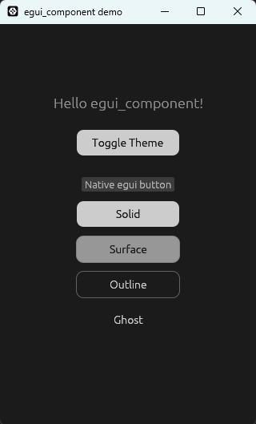
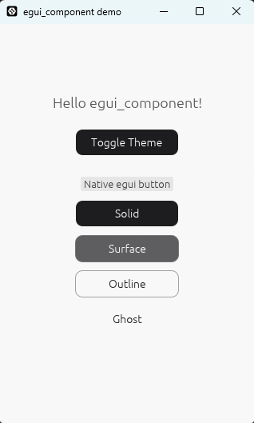

# egui_component

[English](README.md) | [中文](README.zh.md)

[](https://crates.io/crates/egui_component)
[](LICENSE)





## 🚀 简介

**egui_component** 是一个专为 [egui](https://github.com/emilk/egui) 打造的现代化、非侵入式组件库。它同时提供了一套预设的组件样式和一个功能完善的样式系统，在开箱即用的同时开发者也有完全控制组件外观的能力。

并且得益于非侵入式设计，你可以无缝地在任何 `eframe` 或自定义 `egui` 框架中使用它，而无需修改现有的 UI 架构。

## ✨ 特性

- **🧩 非侵入式 (Non-Intrusive)**：不强制接管全局 `Visuals`，可以与原生 egui 控件完美并存。
- **✨ 现代样式**： 开箱即用的现代组件样式，提升应用视觉质感。
- **🎨 灵活的样式系统**：高度解耦，每个组件的视觉属性均可完全自定义。
- **🌓 颜色模式友好**：原生支持深色/浅色模式切换。

## 📦 安装

将以下依赖添加到你的 `Cargo.toml` 文件中：

```toml
[dependencies]
egui_component = "0.1.0-alpha.2"
```

## 📝 快速开始

`egui_component` 遵循 egui 的立即模式（Immediate Mode）设计哲学。如果你熟悉 egui，上手将非常自然。

```rust
use egui_component::components::button;
use egui_component::theme::{UiTheme, ColorMode};

fn my_page(ui: &mut egui::Ui) {
    // 1. 加载主题配置 (建议在应用初始化时加载一次并存储在全局或持久化状态中)
    // 示例代码假定你有一个合法的 theme.json
    let ui_theme = UiTheme::from_json_bytes(include_bytes!("theme.json")).unwrap();

    // 2. 选择当前使用的颜色模式（例如使用暗色主题）
    let theme = &ui_theme.dark;

    ui.horizontal(|ui| {
        // 使用内置的预设样式快速渲染并处理交互
        if button::render(ui, "Solid", button::Style::new_solid_md(theme)).clicked() {
            println!("Solid button clicked!");
        }

        button::render(ui, "Surface", button::Style::new_surface_md(theme));
        button::render(ui, "Outline", button::Style::new_outline_md(theme));
        button::render(ui, "Ghost", button::Style::new_ghost_md(theme));
    });
}
```

## 📖 示例

更多示例请查看 `examples/` 目录。

## 📄 LICENSE

本项目及其包含的所有包均在 **MIT License** 下发布。
